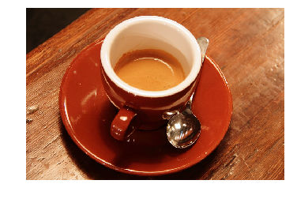
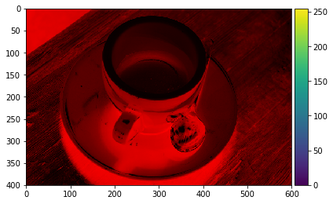
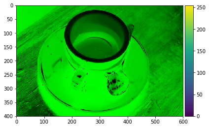
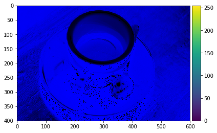
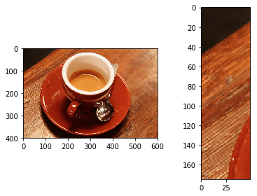
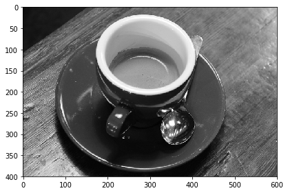

# Lecture # 1: 
> # Basic of image processing using python

# Lecture Video:

# SKimage library
> ## We will use Skimage library to read, write and manipute different ascpects in an image. 

You can use either of the two options below

+ For google-colab,
enter the url in the browser
> https://colab.research.google.com/

and you can run the following commands directly. or use the pip3 commands directly to install scipy (SkImage). 


+ For linux or WSL (Windows sybsytems for linux)
check python vercion by typing
> python3 --version

and make sure you have python3 installed
if not please install 
> sudo apt install python3

+ You can install pip3 by using the follwoing command
>  sudo apt install python3-pip

+ install SKimage using the following command.
> sudo pip3 install scipy


## Read sample Image: 


```python
from skimage import io
import matplotlib
import matplotlib.pyplot as plt
from skimage import data
import numpy as np
img = data.coffee() 
plt.imshow(img)
plt.axis('off')
print("Data Type: ",img.dtype)
img_double = img.astype(np.double)
print("Data Type: ",img_double.dtype)
print(img[1,1,:])
print(img_double[1,1,:])
```

    Data Type:  uint8
    Data Type:  float64
    [21 13  9]
    [21. 13.  9.]


    

    


```python
# Use the following url for details of data. 
# http://scikit-image.org/docs/dev/api/skimage.data.html?highlight=data#module-skimage.data
# we can also read image form internet using thr url
# img = io.imread('https://john-lazzaro.github.io/jqt/en_orig.jpg')
# to read the image stored on loacl hard drive. use the following command
# img = io.imread('sample_image1.jpg')
```

## Shape of an image Array/Matrix


```python
img_shape = img.shape
print("image shape (rows, columns, colors(layers)) = ", img_shape)
img_layer_shape = img[:,:,0].shape
print("shape of 1 layer for the image = ", img_layer_shape)
```

    image shape (rows, columns, colors(layers)) =  (400, 600, 3)
    shape of 1 layer for the image =  (400, 600)


 Components of an RGB color space image
> <font color=red>Red</font>
> <font color=green>Green</font>
> <font color=blue>Blue</font>


```python
import numpy as np
## RED colro space 
### set all other color spaces to zero
img_r, img_g, img_b = np.zeros(img.shape), np.zeros(img.shape), np.zeros(img.shape)
img_r[:,:,0] = img[:,:,0]
io.imshow(img_r)
```

    C:\ProgramData\Anaconda3\lib\site-packages\skimage\io\_plugins\matplotlib_plugin.py:51: FutureWarning: Conversion of the second argument of issubdtype from `float` to `np.floating` is deprecated. In future, it will be treated as `np.float64 == np.dtype(float).type`.
      out_of_range_float = (np.issubdtype(image.dtype, np.float) and
    C:\ProgramData\Anaconda3\lib\site-packages\skimage\io\_plugins\matplotlib_plugin.py:77: UserWarning: Float image out of standard range; displaying image with stretched contrast.
      warn("Float image out of standard range; displaying "


    <matplotlib.image.AxesImage at 0x20d6314f550>


    

    


## Green color space 
### set all other color spaces to zero


```python
img_g[:,:,1] = img[:,:,1]
io.imshow(img_g)
```

    C:\ProgramData\Anaconda3\lib\site-packages\skimage\io\_plugins\matplotlib_plugin.py:51: FutureWarning: Conversion of the second argument of issubdtype from `float` to `np.floating` is deprecated. In future, it will be treated as `np.float64 == np.dtype(float).type`.
      out_of_range_float = (np.issubdtype(image.dtype, np.float) and
    C:\ProgramData\Anaconda3\lib\site-packages\skimage\io\_plugins\matplotlib_plugin.py:77: UserWarning: Float image out of standard range; displaying image with stretched contrast.
      warn("Float image out of standard range; displaying "


    <matplotlib.image.AxesImage at 0x20d63226400>


    

    


## Green color space 
set all other color spaces to zero


```python
img_b[:,:,2] = img[:,:,2]
io.imshow(img_b)
```

    C:\ProgramData\Anaconda3\lib\site-packages\skimage\io\_plugins\matplotlib_plugin.py:51: FutureWarning: Conversion of the second argument of issubdtype from `float` to `np.floating` is deprecated. In future, it will be treated as `np.float64 == np.dtype(float).type`.
      out_of_range_float = (np.issubdtype(image.dtype, np.float) and
    C:\ProgramData\Anaconda3\lib\site-packages\skimage\io\_plugins\matplotlib_plugin.py:77: UserWarning: Float image out of standard range; displaying image with stretched contrast.
      warn("Float image out of standard range; displaying "


    <matplotlib.image.AxesImage at 0x20d639200b8>


    

    


## Pixel manipulation in an image


```python
print("pixel value = ", img[1,1,0])

```

    pixel value =  21


```python

print("Single color pixel values = ",img[1,1,:])
```

    Single color pixel values =  [21 13  9]


Image Cropping
> variable_name[rows, columns, color]


```python
plt.subplot(1, 2, 1)
plt.imshow(img)
plt.subplot(1, 2, 2)
io.imshow(img[25:200,50:100,:])
```

    C:\ProgramData\Anaconda3\lib\site-packages\skimage\io\_plugins\matplotlib_plugin.py:51: FutureWarning: Conversion of the second argument of issubdtype from `float` to `np.floating` is deprecated. In future, it will be treated as `np.float64 == np.dtype(float).type`.
      out_of_range_float = (np.issubdtype(image.dtype, np.float) and


    <matplotlib.image.AxesImage at 0x20d63322f98>


    

    


## Convert image into grayscale
> Single layer as compared to 3 in color image


```python
from skimage import color
img_gray = color.rgb2gray(img)
io.imshow(img_gray)
```

    C:\ProgramData\Anaconda3\lib\site-packages\skimage\io\_plugins\matplotlib_plugin.py:51: FutureWarning: Conversion of the second argument of issubdtype from `float` to `np.floating` is deprecated. In future, it will be treated as `np.float64 == np.dtype(float).type`.
      out_of_range_float = (np.issubdtype(image.dtype, np.float) and


    <matplotlib.image.AxesImage at 0x20d6339b780>


    

    


## Storage size of an image: 

$size (bits) = rows \times columns \times colors(rgb) \times grey levels$

$size (bits) = 256 \times 384 \times 3 \times 8 $


```python
import numpy as np
#size of an image
img_shape = img.shape
print("Image resolution :",img_shape)
img_size = np.prod(img_shape)
print("Storage size in bits: ", img_size*8)

print("Storage size in bytes: ", img_size)
```

    Image resolution : (400, 600, 3)
    Storage size in bits:  5760000
    Storage size in bytes:  720000


```python

```
