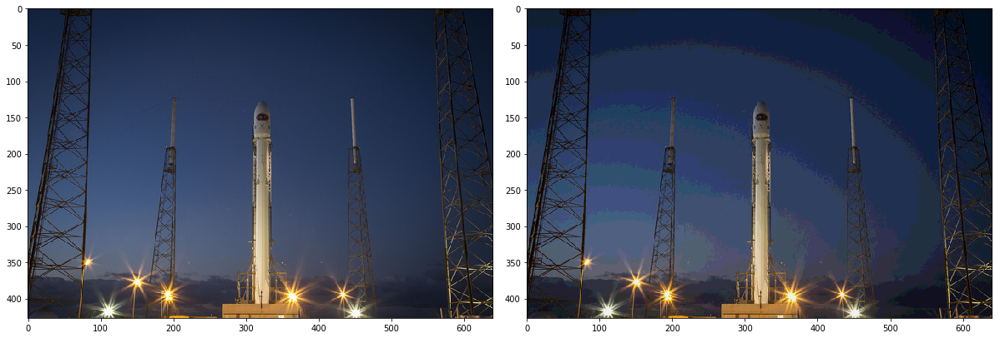
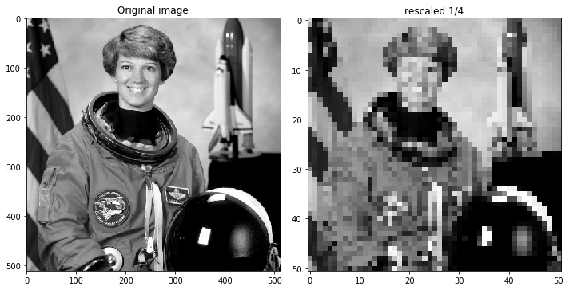
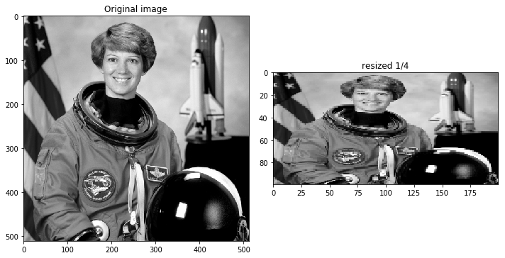
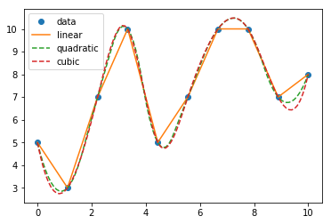
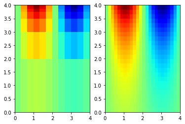
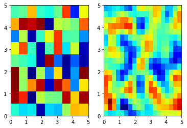

# Sampling, Quantization and Interpolation


Use any of the following command to install "scipy" library if you get an error. 

+ sudo pip install scipy
or 
+ sudo pip3 install scipy
or 
+ conda install scipy

## Image resize, rescale

```python
import matplotlib.pyplot as plt

from skimage import data, color
from skimage.transform import rescale, resize, downscale_local_mean

image = color.rgb2gray(data.astronaut())

image_rescaled = rescale(image, 0.25, anti_aliasing=False)
image_resized = resize(image, (image.shape[0] // 4, image.shape[1] // 4),
                       anti_aliasing=True)
image_downscaled = downscale_local_mean(image, (4, 3))

fig, axes = plt.subplots(nrows=2, ncols=2)

ax = axes.ravel()

ax[0].imshow(image, cmap='gray')
ax[0].set_title("Original image")

ax[1].imshow(image_rescaled, cmap='gray')
ax[1].set_title("Rescaled image (aliasing)")

ax[2].imshow(image_resized, cmap='gray')
ax[2].set_title("Resized image (no aliasing)")

ax[3].imshow(image_downscaled, cmap='gray')
ax[3].set_title("Downscaled image (no aliasing)")

ax[0].set_xlim(0, 512)
ax[0].set_ylim(512, 0)
plt.tight_layout()
plt.show()


```
## Output


## 1D interpolation

```python

from scipy import power, arange
from scipy.interpolate import interp1d
x = arange(0, 5)
y = power(x + 2, 3)
xnew = arange(0, 4, 0.5)

f = interp1d(x, y)
print f(xnew)

OUTPUT
[   8.    17.5   27.    45.5   64.    94.5  125.   170.5]

f = interp1d(x, y, "zero")
print f(xnew)

OUTPUT
[   8.    8.   27.   27.   64.   64.  125.  125.]

f = interp1d(x, y, "cubic")
print f(xnew)

OUTPUT
[   8.      15.625   27.      42.875   64.      91.125  125.     166.375]

f = interp1d(x, y, "quadratic")
print f(xnew)

OUTPUT
[   8.    15.5   27.    43.    64.    91.   125.   166.5]

```

## 2D interpolation
```python

from scipy import random, mgrid
from scipy.interpolate import griddata
def f(x, y):
    return x + y

grid_x, grid_y = mgrid[0:1:5j, 0:1:5j]
points = random.rand(25, 2)
values = f(points[:, 0], points[:, 1])

print griddata(points, values, (grid_x, grid_y), method="cubic")


OUTPUT
[[  nan   nan   nan   nan   nan]
 [  nan  0.5   0.75  1.     nan]
 [  nan  0.75  1.    1.25   nan]
 [  nan  1.    1.25  1.5    nan]
 [  nan   nan   nan   nan   nan]]

 

print griddata(points, values, (grid_x, grid_y), method="nearest")
OUTPUT
[[ 0.15816536  0.15816536  0.6364253   0.85283824  1.0880222 ]
 [ 0.33930886  0.33930886  0.79653985  1.0387893   1.0880222 ]
 [ 0.75785667  0.93651026  1.02458428  1.24200854  1.4936412 ]
 [ 0.75785667  0.75785667  1.32061996  1.33740459  1.6481689 ]
 [ 0.75785667  1.34710428  1.34710428  1.77777691  1.77777691]]

```
Video
[](http://www.youtube.com/watch?v=s-3l_527ydQ "")


### Quantization : Intensity levels
#### How many intensity levels are in an image?
Number of intensity levels = 2^(number of bits assigned to one pixel)


```python
from skimage import data,io
import matplotlib
import matplotlib.pyplot as plt

plt.figure(figsize=(25,25))

img = data.rocket()
plt.subplot(1,3,1)
io.imshow(img)

print(img[2,2])

img_quantized = img & 0b11110000

print(img_quantized[2,2])

plt.subplot(1,3,2)
io.imshow(img_quantized)
```

    C:\ProgramData\Anaconda3\lib\site-packages\skimage\io\_plugins\matplotlib_plugin.py:51: FutureWarning: Conversion of the second argument of issubdtype from `float` to `np.floating` is deprecated. In future, it will be treated as `np.float64 == np.dtype(float).type`.
      out_of_range_float = (np.issubdtype(image.dtype, np.float) and


    [18 34 60]
    [16 32 48]


    <matplotlib.image.AxesImage at 0x2e8c5f82dd8>


    

    


## Rescale image : 
### Rescale operation resizes an image by a given scaling factor.
### The scaling factor can either be a single floating point value, or multiple values - one along each axis.


```python
from skimage import data, color
import numpy as np
from skimage.transform import rescale, resize

image = color.rgb2gray(data.astronaut())
image_rescaled = rescale(image, 0.25)
plt.figure(figsize=(10,10))

plt.subplot(1, 2, 1)
io.imshow(image)
plt.title('Original image')

plt.subplot(1, 2, 2)
image_rescaled = rescale(image, 0.1)
io.imshow(image_rescaled)
plt.title('rescaled 1/4')

```

    C:\ProgramData\Anaconda3\lib\site-packages\skimage\transform\_warps.py:84: UserWarning: The default mode, 'constant', will be changed to 'reflect' in skimage 0.15.
      warn("The default mode, 'constant', will be changed to 'reflect' in "
    C:\ProgramData\Anaconda3\lib\site-packages\skimage\io\_plugins\matplotlib_plugin.py:51: FutureWarning: Conversion of the second argument of issubdtype from `float` to `np.floating` is deprecated. In future, it will be treated as `np.float64 == np.dtype(float).type`.
      out_of_range_float = (np.issubdtype(image.dtype, np.float) and


    Text(0.5,1,'rescaled 1/4')


    

    


## Resize Image
### Resize serves the same purpose, but allows to specify an output image shape instead of a scaling factor. 
### only integers are allowed as output image size


```python
plt.figure(figsize=(10,10))

plt.subplot(1, 2, 1)
io.imshow(image, cmap='gray')
plt.title('Original image')
print(image.shape)

image_resized = resize(image, (100, 200)) #only integers
#image_resized = resize(image, (image.shape[0] / 4, image.shape[1] / 8))

plt.subplot(1, 2, 2)
io.imshow(image_resized, cmap='gray' )
plt.title('resized 1/4')
```

    (512, 512)


    C:\ProgramData\Anaconda3\lib\site-packages\skimage\io\_plugins\matplotlib_plugin.py:51: FutureWarning: Conversion of the second argument of issubdtype from `float` to `np.floating` is deprecated. In future, it will be treated as `np.float64 == np.dtype(float).type`.
      out_of_range_float = (np.issubdtype(image.dtype, np.float) and
    C:\ProgramData\Anaconda3\lib\site-packages\skimage\transform\_warps.py:84: UserWarning: The default mode, 'constant', will be changed to 'reflect' in skimage 0.15.
      warn("The default mode, 'constant', will be changed to 'reflect' in "


    Text(0.5,1,'resized 1/4')


    

    


## 1-D Interpolation


```python
from scipy.interpolate import interp1d
x = np.linspace(0, 10, num=10, endpoint=True)
y = [5,3,7,10,5,7,10,10,7,8]
# x and y defines the x and y coordinate for a point

f = interp1d(x, y)
f2 = interp1d(x, y, kind='quadratic') # second degree polynomial
f3 = interp1d(x,y, kind='cubic')

# num is the number of points between 0 to 10.
xnew = np.linspace(0, 10, num=100, endpoint=True)
plt.plot(x, y, 'o', xnew, f(xnew), '-', xnew, f2(xnew), '--', xnew, f3(xnew), '--')
plt.legend(['data', 'linear', 'quadratic', 'cubic'], loc='best')
plt.show()
```


    

    


# 2D Interpolation


```python
from scipy.interpolate import interp2d
x = np.linspace(0, 4, 13)
y = np.array([0, 2, 3, 3.5, 3.75, 3.875, 3.9375, 4])
X, Y = np.meshgrid(x, y)
# create a rectangular grid out of an array of x values and an array of y values.
Z = np.sin(np.pi*X/2) * np.exp(Y/2)

x2 = np.linspace(0, 4, 25) 
y2 = np.linspace(0, 4, 25)
f = interp2d(x, y, Z, kind='cubic')
Z2 = f(x2, y2)

fig, ax = plt.subplots(nrows=1, ncols=2)
ax[0].pcolormesh(X, Y, Z, cmap='jet')
# pcolormesh = pseudocolor plot 

X2, Y2 = np.meshgrid(x2, y2)
ax[1].pcolormesh(X2, Y2, Z2, cmap='jet')
plt.show()
```


    

    


```python
x = np.linspace(0, 5, 10)
y = np.linspace(0, 5, 10)
X, Y = np.meshgrid(x, y)
# create a rectangular grid out of an array of x values and an array of y values.
from random import randrange

Z = np.random.rand(10,10)

x2 = np.linspace(0, 5, 20) 
y2 = np.linspace(0, 5, 20)
f = interp2d(x, y, Z, kind='cubic')
Z2 = f(x2, y2)

fig, ax = plt.subplots(nrows=1, ncols=2)
ax[0].pcolormesh(X, Y, Z, cmap='jet')
# pcolormesh = pseudocolor plot 

X2, Y2 = np.meshgrid(x2, y2)
ax[1].pcolormesh(X2, Y2, Z2, cmap='jet')
plt.show()
```


    

    


```python
interp2d?
```

# Thank you


```python

```


```python

```
