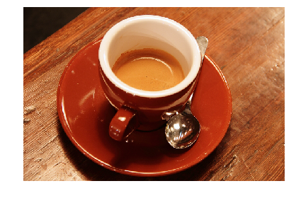
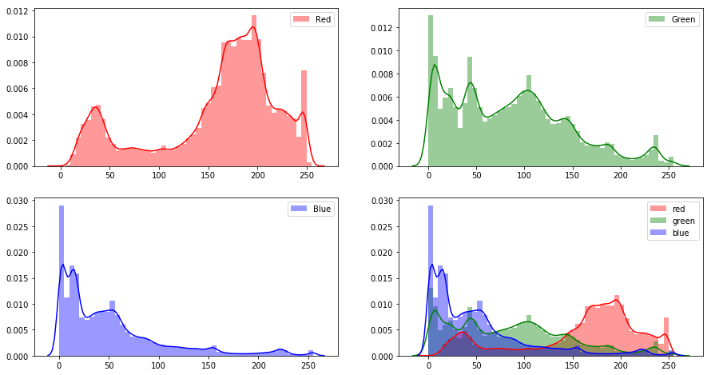
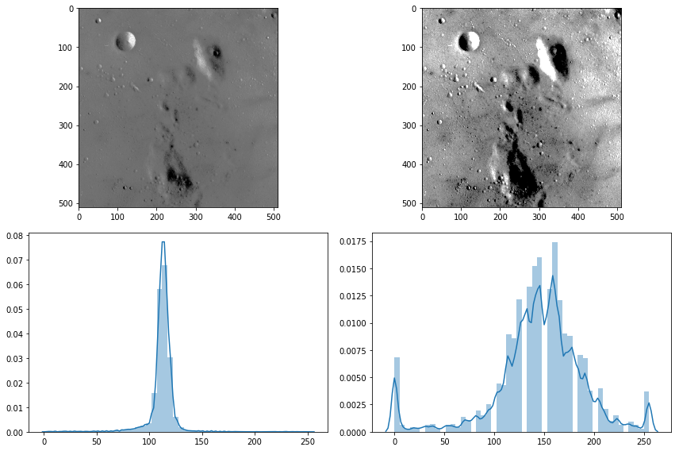
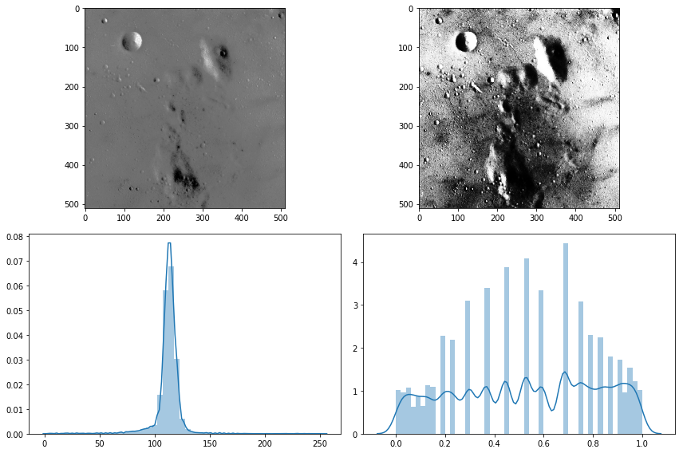
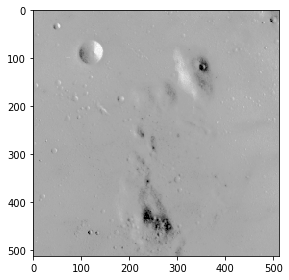
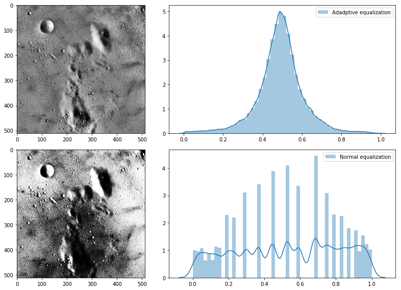

# Intensity transformations
## We can maniputate pixels intensity to improve the representation of data in an image. 

# Read image from skimage data library


```python
import numpy as np
import matplotlib
import matplotlib.pyplot as plt
from skimage import io, data, img_as_float
import seaborn as sns
```


```python
img = data.coffee()
io.imshow(img)
plt.axis('off')
```

    C:\ProgramData\Anaconda3\lib\site-packages\skimage\io\_plugins\matplotlib_plugin.py:51: FutureWarning: Conversion of the second argument of issubdtype from `float` to `np.floating` is deprecated. In future, it will be treated as `np.float64 == np.dtype(float).type`.
      out_of_range_float = (np.issubdtype(image.dtype, np.float) and


    (-0.5, 599.5, 399.5, -0.5)


    

    


# Display histograms for each color channel
## Histogram represents the frequency of all intensity levels in an image


```python
import seaborn as sns
plt.figure(figsize=(15,8))
plt.subplot(2,2,1)
sns.distplot(img[:,:,0].ravel(), color='red', label='Red')
plt.legend()

plt.subplot(2,2,2)
sns.distplot(img[:,:,1].ravel(), color='green', label='Green')
plt.legend()

plt.subplot(2,2,3)
sns.distplot(img[:,:,2].ravel(), color='blue', label='Blue')
plt.legend()

plt.subplot(2, 2, 4)
sns.distplot(img[:,:,0].flatten(), color='red', label='red')
sns.distplot(img[:,:,1].flatten(), color='green', label='green')
sns.distplot(img[:,:,2].flatten(), color='blue', label='blue')
plt.legend()
```


    <matplotlib.legend.Legend at 0x263358a5748>


    

    


# Rescale intensity 
## We can rescale intensity to improve the respresenation of data. Some intensity levels are unused in the image. We can rescale intensit to cover the complate color space


```python
from skimage import color, exposure
plt.figure(figsize=(12,8))

img_gray = data.moon()

plt.subplot(2,2,1)
io.imshow(img_gray)

plt.subplot(2,2,3)
sns.distplot(img_gray.ravel())


plt.subplot(2,2,4)
#p2, p98 = np.percentile(img_gray, (2, 98))
#img_rescale = exposure.rescale_intensity(img_gray, in_range=(p2, p98))
img_rescale = exposure.rescale_intensity(img_gray, in_range=(90, 130))
sns.distplot(img_rescale.ravel())

plt.subplot(2,2,2)
io.imshow(img_rescale)
```

    C:\ProgramData\Anaconda3\lib\site-packages\skimage\io\_plugins\matplotlib_plugin.py:51: FutureWarning: Conversion of the second argument of issubdtype from `float` to `np.floating` is deprecated. In future, it will be treated as `np.float64 == np.dtype(float).type`.
      out_of_range_float = (np.issubdtype(image.dtype, np.float) and


    <matplotlib.image.AxesImage at 0x2632dfd0da0>


    

    


# Histogram equalization
## histogram equalization automatically scale image intensities over the whole color space


```python

plt.figure(figsize=(12,8))

img_gray = data.moon()

plt.subplot(2,2,1)
io.imshow(img_gray)

plt.subplot(2,2,3)
sns.distplot(img_gray.ravel())
#sns.kdeplot(img_gray.ravel(), cumulative=True)

plt.subplot(2,2,4)
#p2, p98 = np.percentile(img_gray, (2, 98))
#img_rescale = exposure.rescale_intensity(img_gray, in_range=(p2, p98))
img_equalized = exposure.equalize_hist(img_gray)
sns.distplot(img_equalized.ravel())

plt.subplot(2,2,2)
io.imshow(img_equalized)
```

    C:\ProgramData\Anaconda3\lib\site-packages\skimage\io\_plugins\matplotlib_plugin.py:51: FutureWarning: Conversion of the second argument of issubdtype from `float` to `np.floating` is deprecated. In future, it will be treated as `np.float64 == np.dtype(float).type`.
      out_of_range_float = (np.issubdtype(image.dtype, np.float) and


    <matplotlib.image.AxesImage at 0x2632e3c9128>


    

    


# Gamma correction


```python
from skimage import exposure
img_gamma = exposure.adjust_gamma(img_gray, 0.5)
io.imshow(img_gamma)
```

    C:\ProgramData\Anaconda3\lib\site-packages\skimage\io\_plugins\matplotlib_plugin.py:51: FutureWarning: Conversion of the second argument of issubdtype from `float` to `np.floating` is deprecated. In future, it will be treated as `np.float64 == np.dtype(float).type`.
      out_of_range_float = (np.issubdtype(image.dtype, np.float) and


    <matplotlib.image.AxesImage at 0x2632fc4ea90>


    

    


## Adaptive histogram


```python

plt.figure(figsize=(12,8))

img_gray = data.moon()

plt.subplot(2,2,1)
img_adapteq = exposure.equalize_adapthist(img_gray, clip_limit=0.03)
io.imshow(img_adapteq)

plt.subplot(2,2,2)
sns.distplot(img_adapteq.ravel(), label='Adadptive equalization')
plt.legend()

plt.subplot(2,2,4)
#p2, p98 = np.percentile(img_gray, (2, 98))
#img_rescale = exposure.rescale_intensity(img_gray, in_range=(p2, p98))
img_equalized = exposure.equalize_hist(img_gray)
sns.distplot(img_equalized.ravel(), label='Normal equalization')
plt.legend()

plt.subplot(2,2,3)
io.imshow(img_equalized)

```

    C:\ProgramData\Anaconda3\lib\site-packages\skimage\io\_plugins\matplotlib_plugin.py:51: FutureWarning: Conversion of the second argument of issubdtype from `float` to `np.floating` is deprecated. In future, it will be treated as `np.float64 == np.dtype(float).type`.
      out_of_range_float = (np.issubdtype(image.dtype, np.float) and


    <matplotlib.image.AxesImage at 0x1b4683cd4a8>


    

    


# Assignment result evaluation function


```python
def eval_f(orginal_image, transformed_image):
    difference = Original_image - transformed_image
    score = sum(sum(sum(abs(difference)))
    print("Score (lower is better) = ",score)

```

# Thank you

# Questions


```python

```
